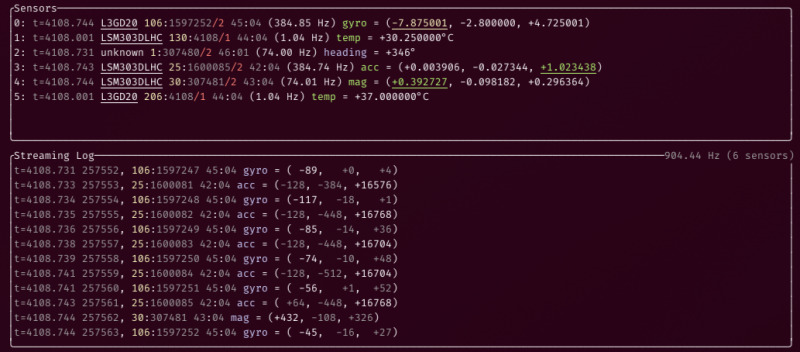

# Serial Sensors

A simple utility program to fetch data off my microcontrollers over a serial connection.
Its primary goal is to provide a host-side implementation of a semi-standardized
protocol for reading sensor data, such as IMU data (accelerometer, magnetometer, gyroscope),
temperature, etc.

I'm currently using it for these projects:

* [`stm32f3disco-rust`](https://github.com/sunsided/stm32f3disco-rust)
  via [`serial-sensors-proto`](https://github.com/sunsided/serial-sensors-proto).

At the moment it doesn't do much, but just dumps out the information as it comes:

