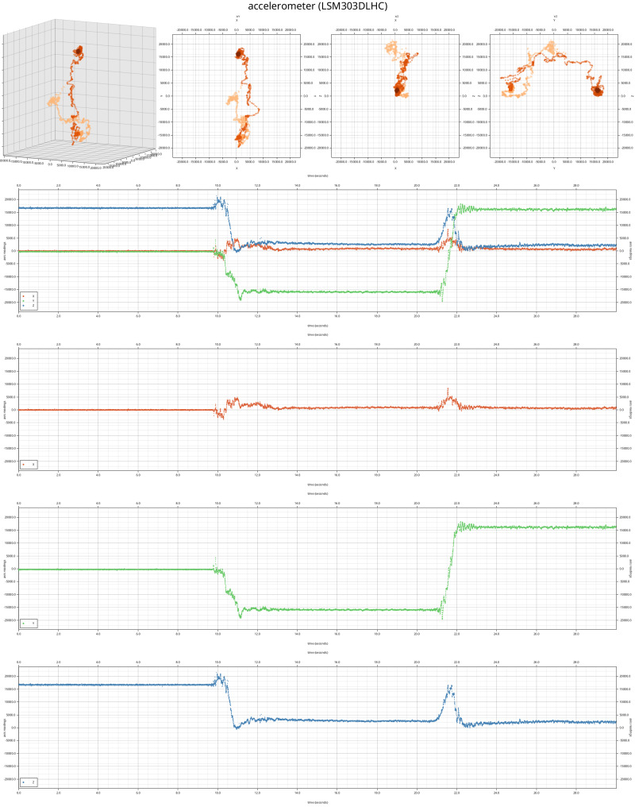
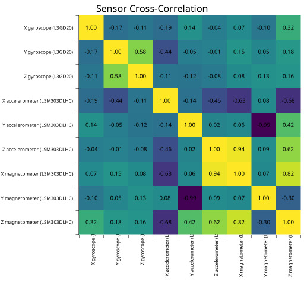

# Serial Sensors

A simple utility program to fetch data off my microcontrollers over a serial connection.
Its primary goal is to provide a host-side implementation of a semi-standardized
protocol for reading sensor data, such as IMU data (accelerometer, magnetometer, gyroscope),
temperature, etc.

I'm currently using it for these projects:

* [`stm32f3disco-rust`](https://github.com/sunsided/stm32f3disco-rust)
  via [`serial-sensors-proto`](https://github.com/sunsided/serial-sensors-proto).

At the moment it doesn't do much: it simply dumps out the information as it comes.


## Logging data streams to disk

By using the `dump` subcommand and the `--dir /path/to/log` arguments, data streams can be logged
as CSV. The command creates one file per sensor and information type. The CSV will contain
both the device-side and host-side timestamps to allow for better inference of sensor data rates
later on.

By using the optional `--raw /path/to/file.bin` argument, the raw data stream can be logged.

```shell
cargo run -- dump --port /dev/ttyACM0 --raw stream.raw --dir dump/
```

## Analyzing data dumps

To analyze data dumps, use the `analyze-dump` command. To run it with the test data, use e.g.

```shell
cargo run --no-default-features --features=analyze -- analyze-dump \
  --dir test/2024-07-06/stm32f3discovery \
  --output test/2024-07-06/stm32f3discovery/output/ \
  --from 10 --to 25
```

Here is an example output for accelerometer measurements:



Sensor cross-correlation suffers a bit from display issues, but it's a starting point:


